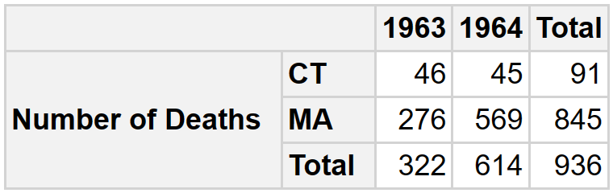
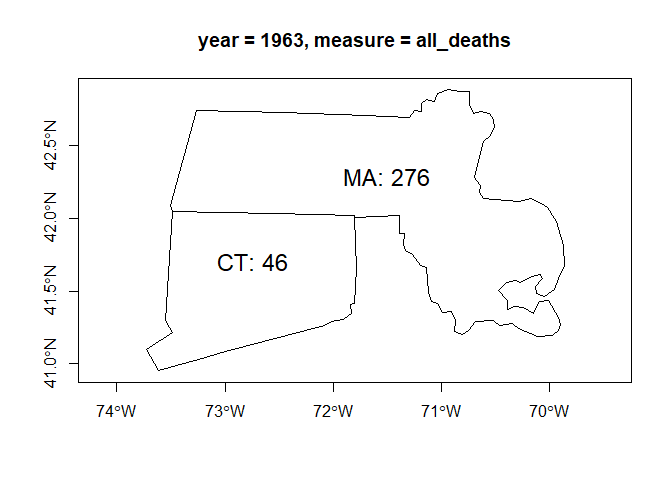
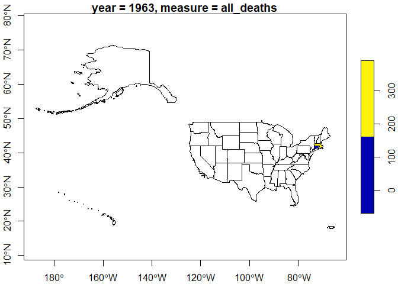

<!-- README.md is generated from README.Rmd. Please edit that file -->

# rolap <a href="https://josesamos.github.io/rolap/"></a>

<!-- badges: start -->

[](https://CRAN.R-project.org/package=rolap)
[](https://github.com/josesamos/rolap/actions/workflows/R-CMD-check.yaml)
[](https://app.codecov.io/gh/josesamos/rolap?branch=master)
[](https://www.r-pkg.org:443/pkg/rolap)
[](https://www.r-pkg.org:443/pkg/rolap)
<!-- badges: end -->

The aim of the *multidimensional data model* is organize data for
supporting data analysis. Data in multidimensional systems is obtained
from operational systems and is transformed to adapt it to the new
structure.

Transformations can be carried out using professional ETL (*Extract,
Transform and Load*) tools. Recently, tools aimed at end users have
emerged, which are also aimed at performing transformation operations.
All these tools are very useful to carry out the transformation process,
they provide a development environment to define the transformation
operations in a general way.

Frequently, the operations to be performed aim to transform a set of
tables with data that comes from operational systems into a ROLAP
(*Relational On-Line Analytical Processing*) star database, made up of
fact and dimension tables, which implements a multidimensional system.
With the tools mentioned above, this transformation can be carried out,
but it requires a lot of work. We are not aware of any tools with
operations designed to specifically support this transformation process.

The goal of `rolap` is to define transformations that allow us to easily
obtain ROLAP star databases, composed by fact and dimension tables, from
operational tables, to be able to export them in various formats to be
used by OLAP query tools and also be able to exploit them from R.

The `rolap` package builds on experience with the
[`starschemar`](https://CRAN.R-project.org/package=starschemar) package
on which it is based. It incorporates the main functionalities for which
`starschemar` was initially intended. In particular, the data model and
the way of treating role-playing and role dimensions have been changed,
so that it is easier to add future extensions. It has been designed in
such a way that migration from `starschemar` is practically immediate.

## Installation

You can install the released version of `rolap` from
[CRAN](https://CRAN.R-project.org) with:

``` r
install.packages("rolap")
```

And the development version from [GitHub](https://github.com/) with:

``` r
devtools::install_github("josesamos/rolap")
```

## Example

To illustrate how the package works we will use a small part of the
[Deaths in 122 U.S. cities - 1962-2016. 122 Cities Mortality Reporting
System](https://catalog.data.gov/dataset/deaths-in-122-u-s-cities-1962-2016-122-cities-mortality-reporting-system)
data set in the form of a flat table, available in the package in the
`ft_num` variable, shown below.

| Year | WEEK | Week Ending Date | REGION | State |    City    | Pneumonia and Influenza Deaths | All Deaths | \<1 year (all cause deaths) | 1-24 years (all cause deaths) | 25-44 years | 45-64 years (all cause deaths) | 65+ years (all cause deaths) |
|:----:|:----:|:----------------:|:------:|:-----:|:----------:|:------------------------------:|:----------:|:---------------------------:|:-----------------------------:|:-----------:|:------------------------------:|:----------------------------:|
| 1962 |  2   |    01/13/1962    |   1    |  MA   |   Boston   |               11               |    270     |             14              |               8               |     11      |               70               |             167              |
| 1962 |  4   |    01/27/1962    |   1    |  MA   |   Boston   |               12               |    285     |             22              |               7               |      8      |               73               |             175              |
| 1963 |  4   |    01/26/1963    |   1    |  MA   |   Boston   |               10               |    276     |             11              |              14               |     17      |               67               |             167              |
| 1964 |  3   |    01/18/1964    |   1    |  MA   |   Boston   |               13               |    325     |             17              |               7               |     24      |               90               |             187              |
| 1964 |  6   |    02/08/1964    |   1    |  MA   |   Boston   |               9                |    244     |             13              |               9               |     14      |               61               |             147              |
| 1962 |  3   |    01/20/1962    |   1    |  CT   | Bridgeport |               2                |     40     |              5              |               1               |      3      |               10               |              21              |
| 1962 |  5   |    02/03/1962    |   1    |  CT   | Bridgeport |               5                |     46     |              6              |               0               |      3      |               15               |              22              |
| 1962 |  8   |    02/24/1962    |   1    |  CT   | Bridgeport |               2                |     45     |              2              |               0               |      2      |               16               |              25              |
| 1963 |  4   |    01/26/1963    |   1    |  CT   | Bridgeport |               2                |     46     |              4              |               0               |      3      |               10               |              29              |
| 1964 |  5   |    02/01/1964    |   1    |  CT   | Bridgeport |               8                |     45     |              3              |               1               |      2      |               11               |              28              |
| 1962 |  9   |    03/03/1962    |   1    |  MA   | Cambridge  |               4                |     39     |              1              |               0               |      2      |               7                |              29              |
| 1964 |  2   |    01/11/1964    |   1    |  MA   | Cambridge  |               7                |     31     |              1              |               0               |      2      |               9                |              19              |
| 1964 |  5   |    02/01/1964    |   1    |  MA   | Cambridge  |               6                |     27     |              2              |               0               |      0      |               8                |              17              |
| 1964 |  9   |    02/29/1964    |   1    |  MA   | Cambridge  |               0                |     26     |              0              |               0               |      2      |               8                |              16              |
| 1962 |  4   |    01/27/1962    |   1    |  CT   |  Hartford  |               1                |     47     |              7              |               1               |      0      |               14               |              25              |
| 1962 |  7   |    02/17/1962    |   1    |  CT   |  Hartford  |               4                |     57     |              3              |               1               |      3      |               21               |              29              |
| 1963 |  3   |    01/19/1963    |   1    |  CT   |  Hartford  |               2                |     66     |              7              |               2               |      3      |               18               |              36              |
| 1963 |  7   |    02/16/1963    |   1    |  CT   |  Hartford  |               4                |     77     |              6              |               1               |      7      |               19               |              44              |
| 1963 |  8   |    02/23/1963    |   1    |  CT   |  Hartford  |               6                |     49     |              3              |               2               |      3      |               14               |              27              |
| 1964 |  2   |    01/11/1964    |   1    |  CT   |  Hartford  |               3                |     53     |              7              |               0               |      2      |               16               |              28              |

### Star database definition

The transformation to obtain a star database from the table using
`rolap` package is as follows:

``` r
library(rolap)

where <- dimension_schema(name = "Where",
                          attributes = c("REGION",
                                         "State",
                                         "City"))

s <- star_schema() |>
  define_facts(name = "MRS Cause",
               measures = c("Pneumonia and Influenza Deaths",
                            "All Deaths")) |>
  define_dimension(name = "When",
                   attributes = c("Year")) |>
  define_dimension(where)

db <- star_database(s, ft_num) |>
  snake_case()
```

The dimension and fact schemas can be defined as variables (`where`) to
be reused or directly in the star schema definition. To make it easier
to work in a database environment we transform the table field names to
snake case.

Geographic attributes can be associated with vector layers of geographic
information.

``` r
db <- db |>
  define_geoattribute(
    dimension = "where",
    attribute = "state",
    from_layer = us_layer_state,
    by = "STUSPS"
  )
```

### Result

To better appreciate the result, let’s export it as a `tibble` list. The
tables of dimensions and facts of the obtained star database are shown
below.

``` r
ls <- db |>
  as_tibble_list()

for (i in 1:length(ls)) {
  pander::pandoc.table(ls[[i]], split.table = Inf)
}
```

| when_key | year |
|:--------:|:----:|
|    1     | 1962 |
|    2     | 1963 |
|    3     | 1964 |

| where_key | region | state |    city    |
|:---------:|:------:|:-----:|:----------:|
|     1     |   1    |  CT   | Bridgeport |
|     2     |   1    |  CT   |  Hartford  |
|     3     |   1    |  MA   |   Boston   |
|     4     |   1    |  MA   | Cambridge  |

| when_key | where_key | pneumonia_and_influenza_deaths | all_deaths | nrow_agg |
|:--------:|:---------:|:------------------------------:|:----------:|:--------:|
|    1     |     1     |               9                |    131     |    3     |
|    1     |     2     |               5                |    104     |    2     |
|    1     |     3     |               23               |    555     |    2     |
|    1     |     4     |               4                |     39     |    1     |
|    2     |     1     |               2                |     46     |    1     |
|    2     |     2     |               12               |    192     |    3     |
|    2     |     3     |               10               |    276     |    1     |
|    3     |     1     |               8                |     45     |    1     |
|    3     |     2     |               3                |     53     |    1     |
|    3     |     3     |               22               |    569     |    2     |
|    3     |     4     |               13               |     84     |    3     |

The result can be exported in various formats such as *csv* and *xslx*
files or to a relational database, as shown below.

``` r
con <- DBI::dbConnect(RSQLite::SQLite())

db |>
  as_rdb(con)

DBI::dbListTables(con)
#> [1] "mrs_cause" "when"      "where"

DBI::dbDisconnect(con)
```

In addition to exporting it, we can formulate multidimensional queries
from R. Below is an example.

``` r
sq <- star_query(db) |>
  select_dimension(name = "where",
                   attributes = "state") |>
  select_dimension(name = "when",
                   attributes = "year") |>
  select_fact(name = "mrs_cause",
              measures = "all_deaths") |>
  filter_dimension(name = "when", year >= "1963") |>
  filter_dimension(name = "where", city == "Bridgeport" | city == "Boston")

db_2 <- db |>
  run_query(sq)
```

The result can be displayed using the
[`pivottabler`](https://CRAN.R-project.org/package=pivottabler) package.

``` r
ft <- db_2 |>
  as_single_tibble_list()
ft_cause <- ft[["mrs_cause"]]

pt <- pivottabler::qpvt(
  ft_cause,
  c("=", "state"),
  c("year"),
  c("Number of Deaths" = "sum(all_deaths)")
)

pt$renderPivot()
```



We can obtain a geographic information layer that includes it, to use it
in R as an object of class `sf`.

``` r
gl <- db_2 |>
  as_geolayer()

l1 <- gl |>
  get_layer()
class(l1)
#> [1] "sf"         "tbl_df"     "tbl"        "data.frame"

title <- gl |>
  get_variable_description("var_1")

plot(sf::st_geometry(l1[, c("var_1")]), axes = TRUE, main = title)
text(
  sf::st_coordinates(sf::st_centroid(sf::st_geometry(l1))),
  labels = paste0(l1$state, ": ", l1$var_1),
  pos = 3,
  cex = 1.5
)
```



We can also include all geographic instances originally present in the
layer.

``` r
l2 <- gl |>
  get_layer(keep_all_variables_na = TRUE)

plot(sf::st_shift_longitude(l2[, "var_1"]), axes = TRUE, main = title)
```



Or export it in *GeoPackage* format.

``` r
f <- gl |>
  as_GeoPackage(dir = tempdir())

sf::st_layers(f)
#> Driver: GPKG 
#> Available layers:
#>   layer_name geometry_type features fields crs_name
#> 1   geolayer       Polygon        2      3   WGS 84
#> 2  variables            NA        2      3     <NA>
```

We can work with several star databases to form a *constellation*. It
supports the definition of *role-playing* and *role* dimensions, as well
as *incremental refresh* operations and automatic deployment on any
RDBMS (*Relational Database Management System*). Examples and detailed
information of these functionalities can be found in the documentation
and vignettes of the package.
